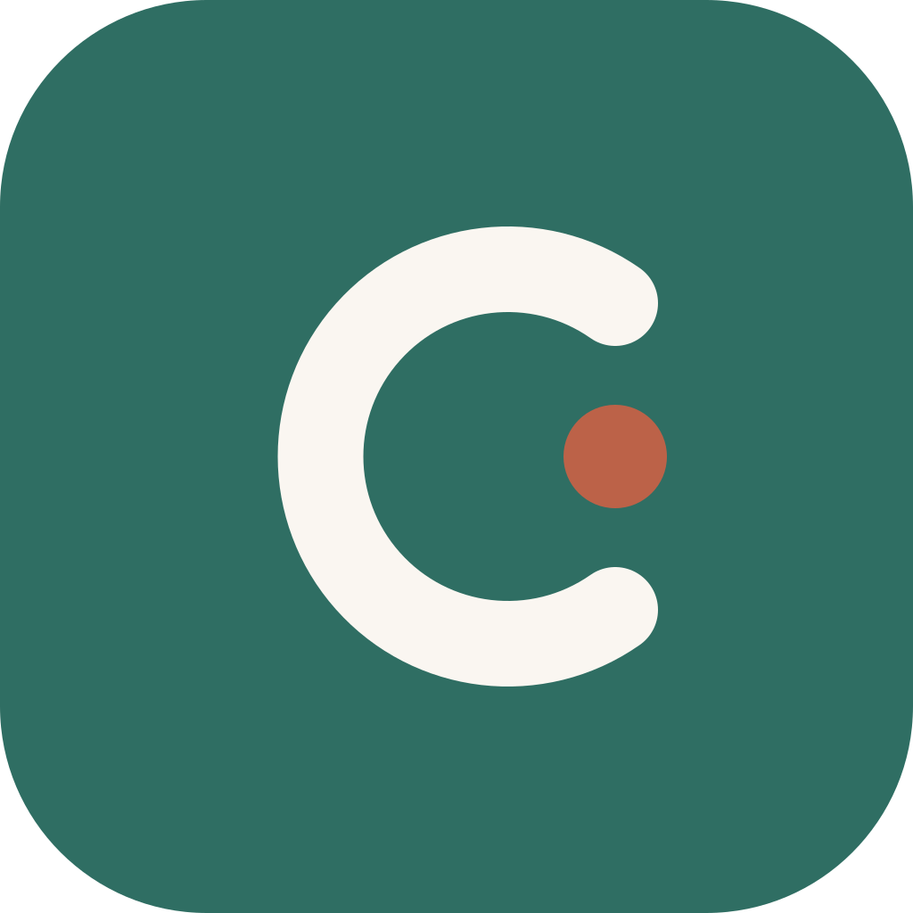

<p align="center">
  
</p>

<h1 align="center">Cadence</h1>

Offline-first blood pressure diary for Android. Session-based readings following the 7-2-2 home monitoring protocol. Flutter, no accounts, no ads, your data stays yours.

Cadence is a blood pressure diary for people who measure at home and want the numbers to mean something.

Most BP apps treat every reading as an isolated event. Cadence treats measurement as a session — the rest, the two readings a minute apart, the morning and the evening — because that's how home monitoring is meant to work. It follows the 7-2-2 protocol recommended in the ESH/AHA guidelines, and shows you not just your numbers but whether you actually collected enough of them to draw a conclusion.

No accounts. No ads. No cloud. Your readings live in a SQLite database on your device, and you can export all of them at any time in a format you can read.

Cadence is a diary, not a medical device. It records what your monitor tells you and does the arithmetic. It does not measure blood pressure, and it does not diagnose anything — that conversation belongs with your doctor.

## Status

The v1.0 feature set is complete and runs end to end on a real device; the
remaining work is the Play-Store release track, so it is **not yet on the Play
Store**. What the app does today:

- **Log** a measurement occasion of one or more readings, with optional
  arm/posture/before-or-after-medication context and a note. Big −/+ steppers
  sized for an older audience, with the first reading pre-filled from your own
  recent morning/evening history.
- **Review** each occasion as its average, and open it to edit a reading,
  remove one, add one, or delete the occasion.
- **Coverage.** A pinned "Last 7 days" card reports 7-2-2 coverage — occasions
  logged against the fourteen expected and days against the seven — plus the
  period average. It flags an average that rests on too few days as partial, and
  can show — behind an opt-in info button — how the average compares to the ESH
  135/85 home reference. It states completeness and cites its source; it never
  judges the numbers or colours a reading.
- **Trends.** A read-only chart screen: systolic/diastolic over time and pulse on
  its own tab, with 7/30/90/All ranges and a morning/evening filter. Neutral
  lines only — no threshold, no verdict.
- **Export / backup.** Versioned JSON backup and restore (merge-by-id), plus
  date-bounded CSV and PDF export to hand a clinician, all through the Android
  share sheet.
- **Settings, disclaimer, theme.** A Settings screen (export + About + theme
  choice), a first-run "diary, not a medical device" disclaimer, a warm Material 3
  theme (Hanken Grotesk) in **light and dark** that follows the phone or can be
  set manually, and **English + Italian**. Release signing is set up.

Built on a three-layer architecture (`lib/domain`, `lib/data`, `lib/ui`) with
strict static analysis, enforced import boundaries, ARB localisation, and a
pre-commit gate. See [`docs/STATUS.md`](docs/STATUS.md) for where things stand,
[`docs/ROADMAP.md`](docs/ROADMAP.md) for the path to 1.0, and
[`CLAUDE.md`](CLAUDE.md) for the architecture and the constraints that shape it.

## Development

Requires the Flutter SDK (stable) and [lefthook](https://lefthook.dev).

On a fresh clone:

```sh
flutter pub get   # fetch dependencies and generate localisations
lefthook install  # wire the pre-commit gate into .git/hooks (once)
```

Run the full gate manually at any time:

```sh
lefthook run pre-commit
```

The drift database code, the schema snapshot, and the migration-test helpers
are generated and committed, so a fresh clone needs no code generation. After
changing the tables, regenerate them and commit the result:

```sh
dart run build_runner build
dart run drift_dev schema dump lib/data/database/app_database.dart lib/data/schema/
dart run drift_dev schema generate lib/data/schema/ test/data/schema/generated/
```

The gate runs `dart format`, `flutter analyze`, `dart analyze` (which enforces the layered import boundaries), and `flutter test`.

## Licence

Apache 2.0 — see [`LICENSE`](LICENSE).
